# final_game_tech

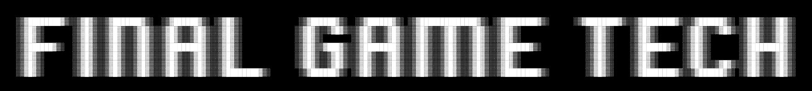

## Description

This repository contains several game/multimedia related libraries mostly written in C99/C17 or C++/11.

Core library is the Final Platform Layer (FPL) library that contains various demo applications showcasing its capabilities.

## Libraries

| Name                                             | Description                                 | Platforms        | Language | Latest Version | State       | Size ~  |
|--------------------------------------------------|---------------------------------------------|------------------|----------|----------------|-------------|---------|
| [final_platform_layer.h](final_platform_layer.h) | Single file platform abstraction library    | Win32/Linux/Unix | C99      | 1.0.0          | Finished    | 1200 KB |
| [final_dynamic_opengl.h](final_dynamic_opengl.h) | Single file opengl loader library           | Win32/Linux/Unix | C99      | 1.0.0          | Finished    | 512 KB  |
| [final_game_box.h](final_game_box.h)             | Single file gameboy DMG/CGB emulator        | Independent      | C99      | 1.3.0          | Finished    | 600 KB  |
| [final_memory.h](final_memory.h)                 | Single file heap memory handling library    | Independent      | C99      | 1.0.1          | Finished    | 24 KB   |
| [final_xml.h](final_xml.h)                       | Single file xml parser library              | Independent      | C99      | 0.3.1-alpha    | Finished    | 28 KB   |
| [final_tiletrace.hpp](final_tiletrace.hpp)       | Single file tilemap contour tracing library | Independent      | C++/11   | 1.02           | Finished    | 36 KB   |

* All libraries written in C99/C17 are fully C++ compatible.
* Few libraries are still in beta/alpha, even though they are finished.
* Only fully implemented, documented and well tested libraries will leave the alpha/beta phase.

## Folder Structure

```
.
├── README.md                       # This file
├── final_platform_layer.h          # Single-header-file platform abstraction library (C99)
├── final_dynamic_opengl.h          # Single-header-file OpenGL function loader (C99)
├── final_game_box.h                # Single-header-file DMG game boy emulator library (C99)
├── final_xml.h                     # Single-header-file simple XML parser library (C99)
├── final_memory.h                  # Single-header-file custom memory allocator (C99)
├── final_tiletrace.hpp             # Single-header-file contour tile tracing library (C++/11)
├── LICENSE.md                      # MIT License-file
├── CLAUDE.md                       # General overview of the repository for AI agents such as claude
├── assets/                         # Assets for the repo itself, like the logo
├── apps/                           # Converters and utility applications (mostly used internally)
├── demos/                          # Demo applications for all libraries (C99 or C++/11)
├── internal/                       # Internal and temporary files 
├── screenshots/                    # Screenshots of the demo applications 
```

## Contributing

### How to contribute

If you want to support any of this library in this repository, you can do this in the following way:

- Compile and test the demos/libraries in several configurations and share your feedback (Platform / Architecture / Compiler / IDE)
- Provide feedback by tickets (features, bugs, improvements, etc).
- Provide new demos to the demos/ folder
- Improve existing demos by pull requests
- Be active in the community, ask questions, help others
- Spread the word / Star the project

### Code Contribution

You are invited to provide pull quests at any time - helping to improve the libraries and/or demos for me or for others.

However, untested, sloppy generated or poorly designed or broken code will not be accepted!

#### Code Quality Requirements

Code that you provide you must have a certain level of quality:
- Compiles without any errors
- Does not break existing libraries or demos
- Follows the same code style and namings of types, functions, defines, etc.
- Prevents collision of existing functions and types by using prefix and long names
- Good readable documentations of all defines, types and functions
- External library loading and handling supports runtime, static and dynamic linking
- Uses as less memory as possible and focus on data-oriented structures
- Uses existing libraries from root or `demos/additions`, whenever possible

Also respect the following rules:
- Prefer `fplMemory*Allocate()` / `fplMemory*Free()` over malloc/free
- Use `final_memory.h`, when you do lots of memory allocations
- Use `final_dynamic_opengl.h`, when you need OpenGL functions
- Use platform preprocessor guards for platform specific code
- Prefer single translation units over multiple translation units
- Prefer C99/C17 over C++/11

### AI Usage

Since 2026, libraries and demos are extensively improved using local and premium AI tools.
Every line of code that is/was generated or modified by AI is/was properly reviewed and tested by humans.

Positive examples are:
- PulseAudio backend for `final_platform_layer.h`
- PipeWire backend for `final_platform_layer.h`
- Critical audio bugfixes in `demos/additions/final_audio*.h`
- Fixing seek in `demos/FPL_FFMpeg`
- Fixing major audio issues in `final_game_box.h`
- Improving emulation processing in `final_game_box.h`
- Game Boy Color support in `final_game_box.h`

It is allowed to provide AI generated code by pull requests, but those must have a certain level of quality (See section [Code Contribution](#code-contribution)).

## Details

You can find more details in the [Final Game Tech](final_game_tech.md).

## License

All libraries in the root folder of this repository are open-source and use the MIT-License. Read [LICENSE](LICENSE) for more details.

## Screenshots

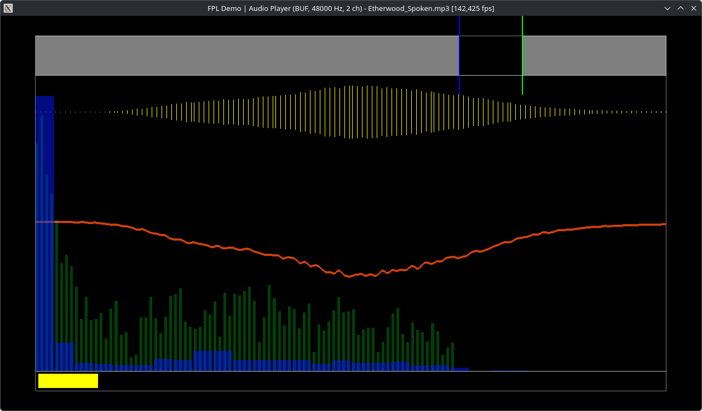

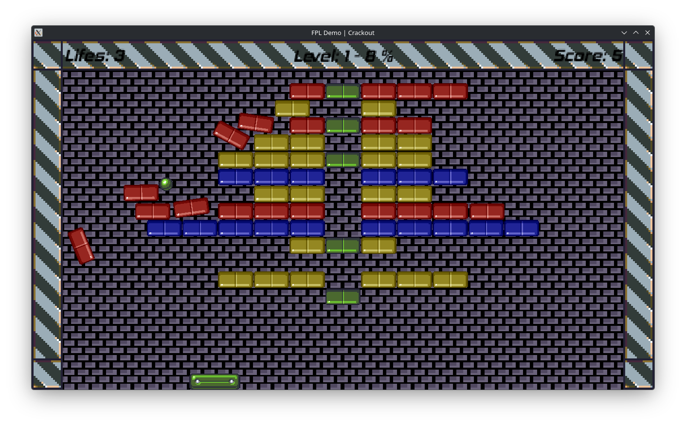

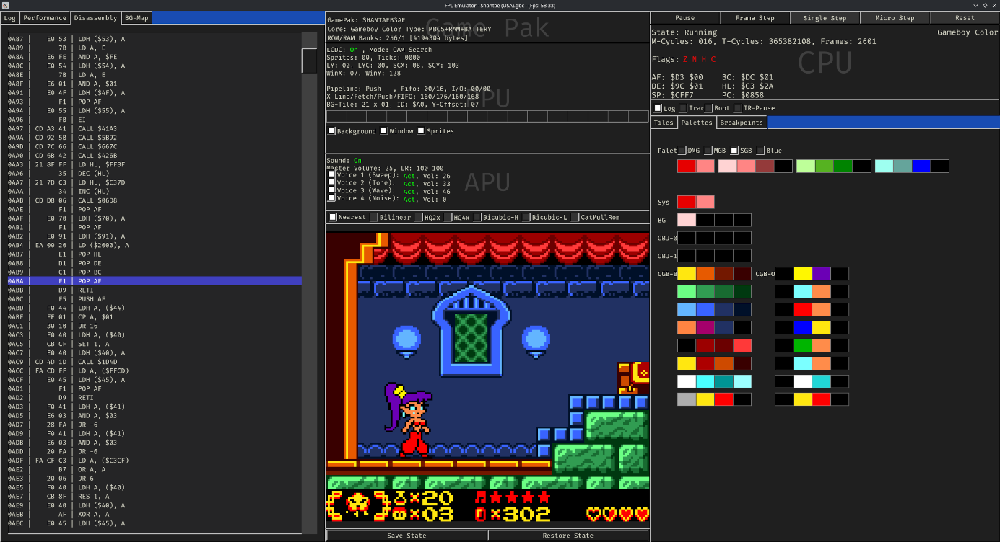

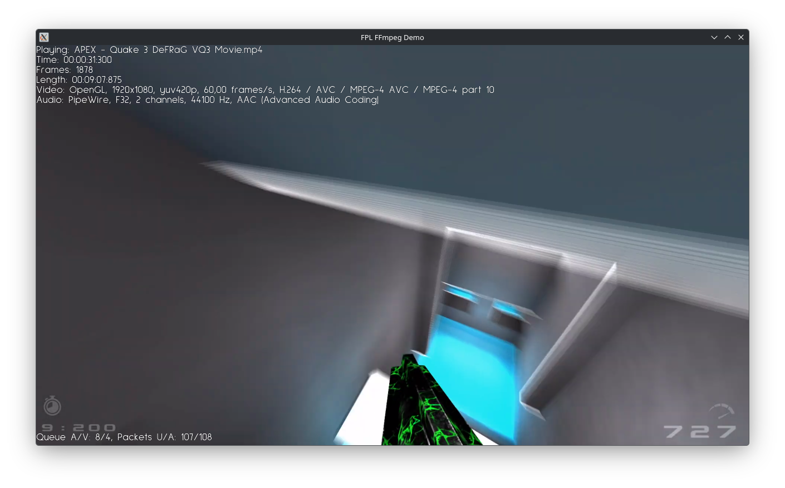

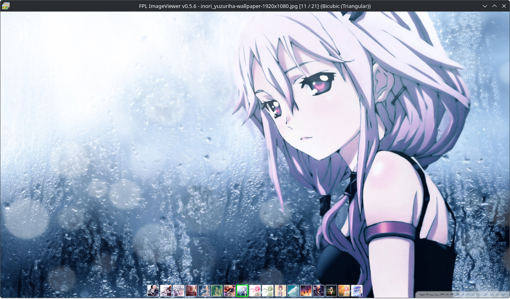

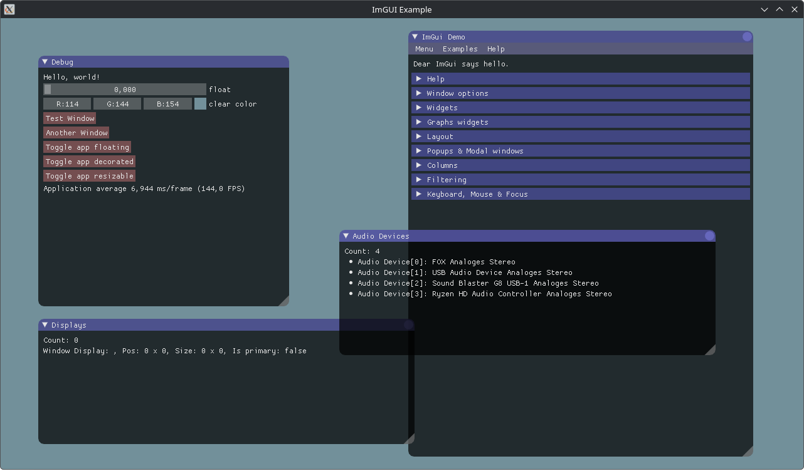

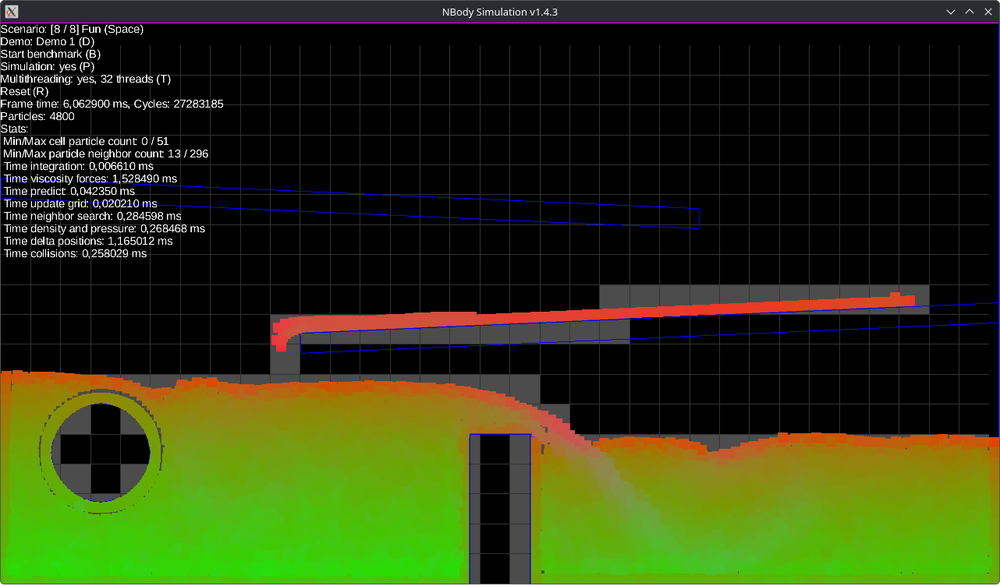

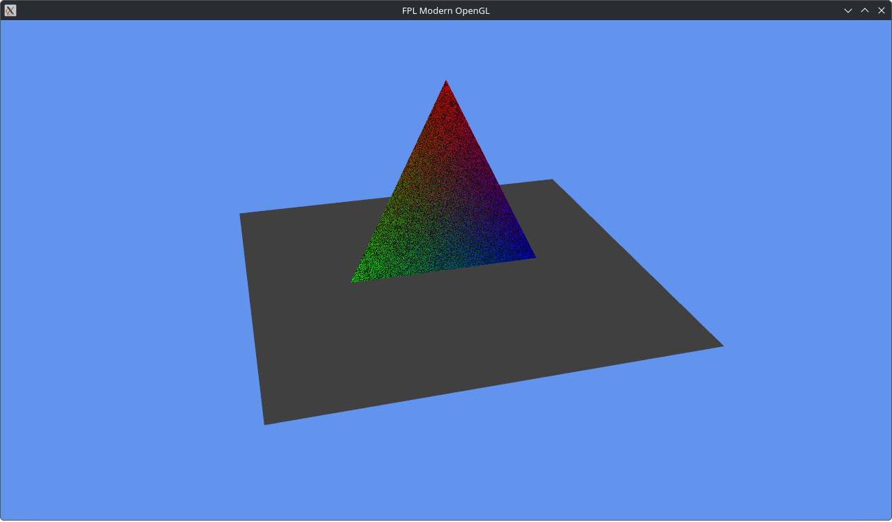

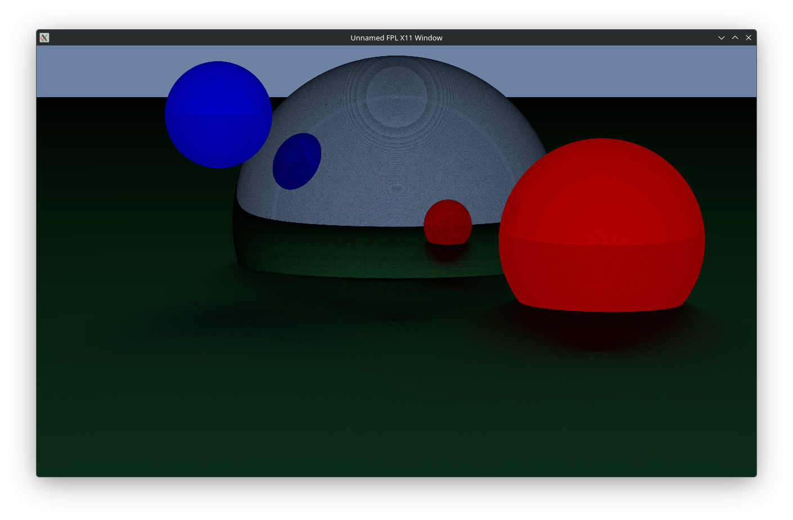

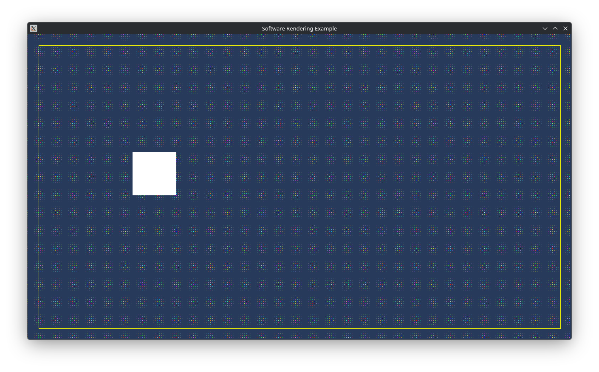

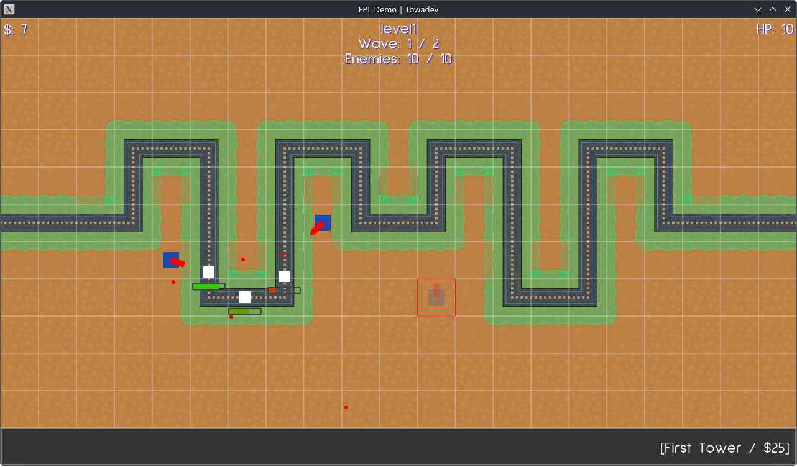

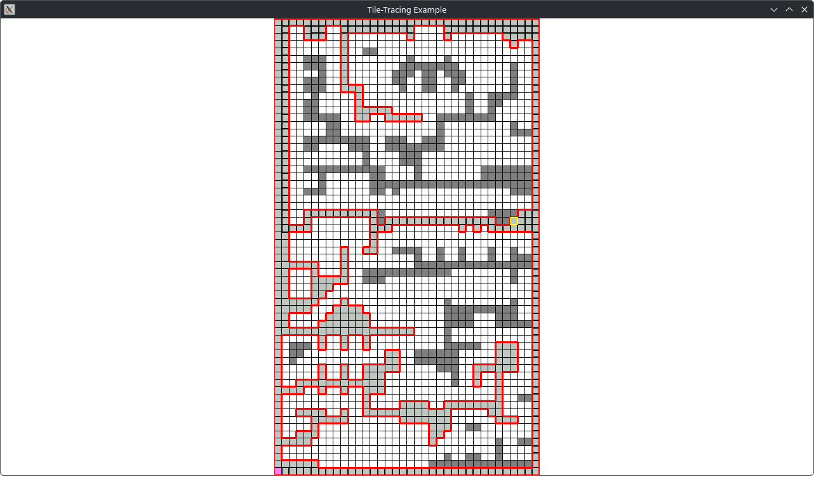
